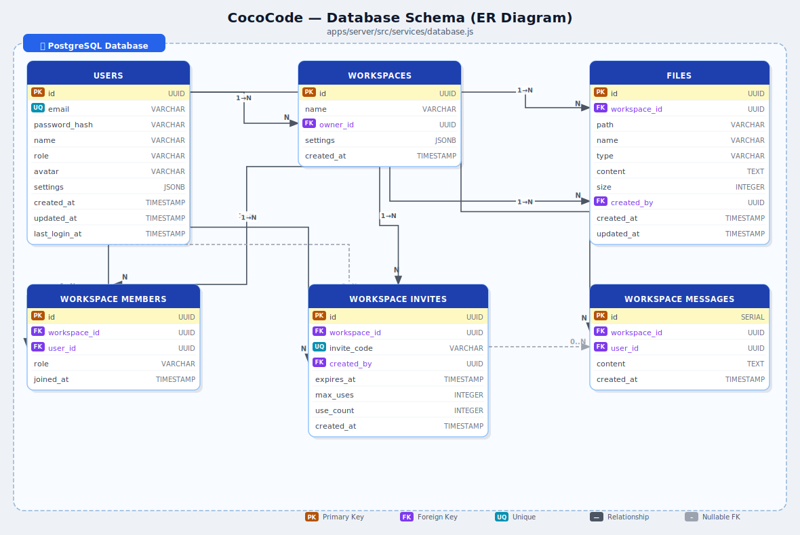

# CocoCode - Collaborative AI-Powered Code Editor

A comprehensive code editor platform with real-time collaboration, AI-powered assistance, and integrated DevOps tools.

## Tech Stack

- **Frontend**: React 18 + JavaScript
- **Backend**: Node.js + Express
- **Real-time**: Socket.io + Y.js (CRDT)
- **Database**: PostgreSQL + Redis
- **AI**: Gemini 2.0
- **Infrastructure**: Docker + Kubernetes

## Getting Started

### Prerequisites

- Node.js >= 18.0.0
- pnpm >= 8.0.0
- Docker & Docker Compose

### Installation

```bash
# Install dependencies
pnpm install

# Start development servers
pnpm dev

# Run with Docker
docker-compose up -d
```

## Current Phase: Real-Time Communication & Collaboration
*(Recently Updated)*

The project is currently in the advanced collaboration phase, focusing on real-time communication:
- **Real-Time Socket Messaging**: Integrated chat functionality using WebSockets.
- **Persistent Chat History**: Chat messages are now persisted and loaded in the sidebar.
- **Peer-to-Peer Calls**: Added WebRTC-based audio/video calling capabilities.
- **Signaling Server**: Dedicated signaling for WebRTC connection negotiation.
- **Sidebar Integration**: Unified communication tools in the workspace UI.
- **Terminal Sync**: Synchronized terminal document state across collaborators.

## Database Schema

The backend uses **PostgreSQL** with 6 tables. The ER diagram below shows all tables, fields, and relationships:



> **Source schema:** [`apps/server/src/services/database.js`](apps/server/src/services/database.js)  
> **Editable diagram:** [`docs/diagrams/er-db-light.drawio`](docs/diagrams/er-db-light.drawio) (open with [diagrams.net](https://app.diagrams.net/))

| Table | Description |
|---|---|
| `users` | Registered accounts (UUID PK, unique email) |
| `workspaces` | Collaborative workspaces (FK: `owner_id → users`) |
| `workspace_members` | Join table for workspace ↔ user membership (CASCADE) |
| `files` | Files within a workspace (FK: `workspace_id`, `created_by`) |
| `workspace_invites` | Invite links with expiry & usage limits |
| `workspace_messages` | Chat messages per workspace (user_id nullable ON DELETE SET NULL) |

## Project Structure

```
cococode/
├── apps/
│   ├── web/          # React frontend
│   └── server/       # Node.js backend
├── packages/
│   ├── shared/       # Shared utilities
│   ├── editor-core/  # Monaco editor wrapper
│   ├── collaboration/# CRDT/real-time logic
│   └── ai-agents/    # AI agent implementations
└── infrastructure/   # Docker, K8s configs
```

## Scripts

| Command | Description |
|---------|-------------|
| `pnpm dev` | Start development servers |
| `pnpm build` | Build all packages |
| `pnpm lint` | Run ESLint |
| `pnpm test` | Run all tests |
| `pnpm format` | Format code with Prettier |

## License

MIT
